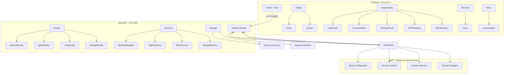

# Architecture du Projet - AI App Builder

## Vue d'ensemble

Ce projet est un **constructeur d'applications IA** inspiré de Lovable, utilisant le GitHub Copilot SDK. Il permet aux utilisateurs de décrire une application en langage naturel et de la faire construire automatiquement par un agent IA.

---

## Diagramme d'Architecture



---

## Structure des Données

### Session (SessionManager)
```typescript
interface Session {
  id: string;              // UUID
  projectId: string;       // ID du projet
  userId: string;           // ID utilisateur
  createdAt: Date;          // Date de création
  permissions: {
    filesystem: 'sandbox' | 'restricted' | 'full';
    allowedCommands: string[];
    maxFileSize: number;
    allowedPorts: number[];
  };
  state: 'active' | 'idle' | 'closed';
}
```

### Task (AgentService)
```typescript
interface Task {
  id: string;
  sessionId: string;
  prompt: string;
  constraints?: {
    stack?: string[];
    accessibility?: boolean;
    mobileFirst?: boolean;
    externalAPIs?: boolean;
    mcpTools?: string[];
  };
  status: 'pending' | 'running' | 'completed' | 'failed';
  createdAt: Date;
  completedAt?: Date;
  result?: any;
  error?: string;
}
```

### MCP Server Config
```typescript
interface MCPServerConfig {
  id: string;
  name: string;
  command: string;
  args: string[];
  env?: Record<string, string>;
  enabled: boolean;
  description?: string;
}
```

---

## Flux de Données

### 1. Création d'une Session
```
User → Builder.tsx → useSessionStore → POST /api/sessions → SessionManager
```

### 2. Envoi d'une Tâche
```
User → ChatPanel.tsx → POST /api/agent/task → AgentService
    → Task créée avec statut 'pending'
    → Exécution asynchrone
    → Streaming des événements via SSE
```

### 3. Gestion MCP
```
MCPBrowser.tsx → GET /api/mcp/tools → MCPService
    → Liste des outils disponibles
    → Exécution via POST /api/mcp/tools/execute
```

---

## Technologies Utilisées

### Frontend
- **React 18** - Framework UI
- **Vite** - Build tool
- **Tailwind CSS** - Styling
- **React Router** - Routing
- **Zustand** - State management
- **React Query** - Data fetching
- **Axios** - HTTP client
- **Lucide React** - Icônes

### Backend
- **Express.js** - Framework web
- **TypeScript** - Langage
- **@modelcontextprotocol/sdk** - Client MCP
- **CORS** - Cross-origin middleware
- **dotenv** - Variables d'environnement

---

## API Endpoints

### Sessions
| Méthode | Endpoint | Description |
|---------|----------|-------------|
| POST | `/api/sessions` | Créer une session |
| GET | `/api/sessions/:sessionId` | Récupérer une session |
| DELETE | `/api/sessions/:sessionId` | Supprimer une session |

### Agent
| Méthode | Endpoint | Description |
|---------|----------|-------------|
| POST | `/api/agent/task` | Envoyer une tâche |
| GET | `/api/agent/task/:taskId` | Statut d'une tâche |
| GET | `/api/agent/stream/:sessionId` | Stream SSE |

### MCP
| Méthode | Endpoint | Description |
|---------|----------|-------------|
| GET | `/api/mcp/servers` | Liste des serveurs |
| POST | `/api/mcp/servers` | Ajouter un serveur |
| PATCH | `/api/mcp/servers/:id` | Modifier un serveur |
| DELETE | `/api/mcp/servers/:id` | Supprimer un serveur |
| GET | `/api/mcp/tools` | Liste des outils |
| POST | `/api/mcp/tools/execute` | Exécuter un outil |
| GET | `/api/mcp/resources` | Liste des ressources |
| POST | `/api/mcp/resources/read` | Lire une ressource |
| GET | `/api/mcp/prompts` | Liste des prompts |

### Storage
| Méthode | Endpoint | Description |
|---------|----------|-------------|
| POST | `/api/storage/projects` | Créer un projet |
| GET | `/api/storage/projects` | Lister les projets |
| GET | `/api/storage/projects/:id` | Récupérer un projet |
| POST | `/api/storage/projects/:id/files` | Sauvegarder un fichier |
| GET | `/api/storage/projects/:id/files/:filename` | Récupérer un fichier |

---

## Fonctionnalités Actuelles

### Phase 1 - MVP ✅
- Architecture frontend/backend complète
- Interface de chat pour les instructions
- Panneau d'aperçu en direct (placeholder)
- Timeline des actions de l'agent (placeholder)
- Gestion des sessions
- Pipeline de déploiement Azure CI/CD
- **Intégration MCP complète**
  - Connexion aux serveurs MCP
  - Outils, ressources et prompts
  - Stockage persistant

### Phase 2 - Intégration Copilot SDK ⏳
- Connexion au Copilot SDK (placeholder)
- Planification et exécution des tâches (placeholder)
- Création/édition de fichiers (placeholder)
- Exécution de commandes (placeholder)

### Phase 3 - Fonctionnalités avancées ⏳
- Templates UI prédéfinis
- Outils de design system
- Déploiement automatique
- Export de projets

---

## Points d'Extension Futurs

### 1. Intégration Copilot SDK
Le `AgentService` contient déjà les structures pour l'intégration mais utilise un placeholder:

```typescript
// backend/src/services/agentService.ts:66-82
// TODO: Integrate with Copilot SDK
// await copilotSession.send({
//   prompt: task.prompt,
//   constraints: task.constraints
// });
```

### 2. Streaming SSE Complet
Le streaming est configuré mais pas complètement implémenté:

```typescript
// backend/src/routes/agent.ts:54-57
// TODO: Implement SSE streaming for agent output
agentService.streamOutput(sessionId, (data) => {
  res.write(`data: ${JSON.stringify(data)}\n\n`);
});
```

### 3. Preview Panel
Le panneau d'aperçu est un placeholder qui attend la connexion avec le serveur de développement de l'utilisateur.

---

## Sécurité

- **Sandbox filesystem**: Permissions configurables
- **Allowlist commandes**: npm, pnpm, vite, eslint, prettier
- **Pas d'accès aux secrets**: Variables d'environnement protégées
- **Isolation par session**: Chaque projet a sa propre session

---

## Déploiement

- **Azure Web Apps** avec CI/CD GitHub Actions
- Variables d'environnement requises:
  - `PORT`
  - `NODE_ENV`
  - `GITHUB_TOKEN`
  - `ALLOWED_ORIGINS`
  - `MCP_STORAGE_DIR`

---

*Document généré le 2026-02-06*
