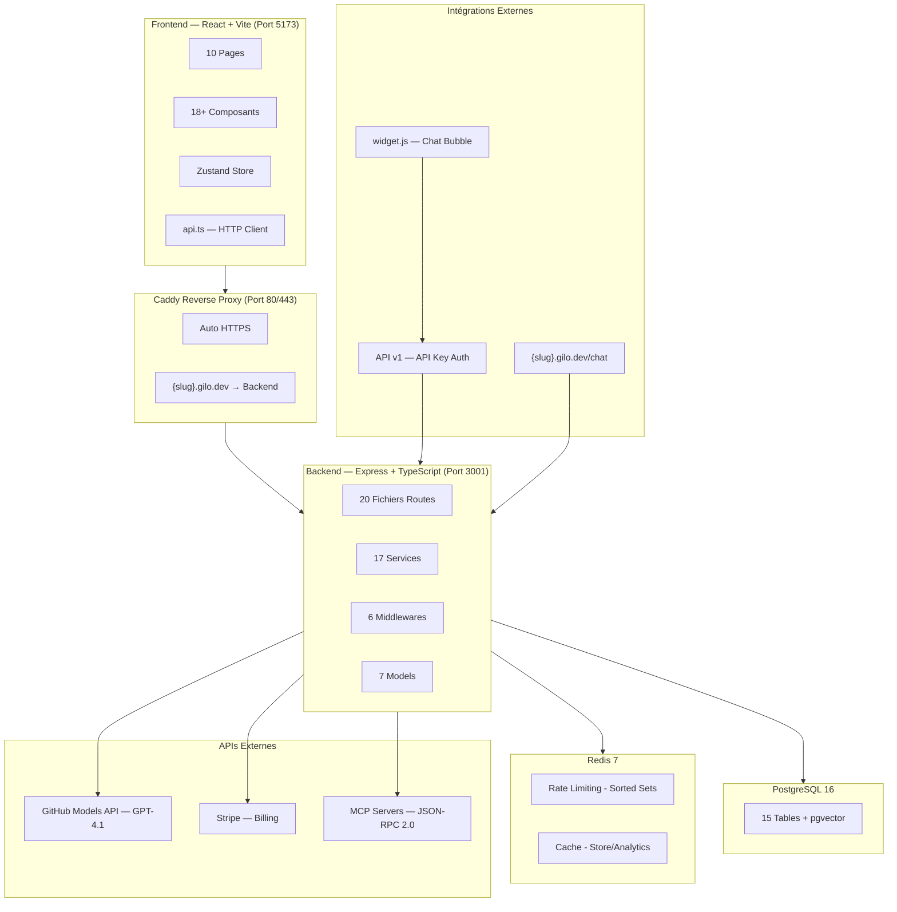

# Architecture du Projet — GiLo AI Agent Builder

> **Dernière mise à jour** : 13 février 2026

## Vue d'ensemble

**GiLo AI** est un constructeur d'agents IA (Agent Builder) avec un **Agent Store** intégré. Il permet de créer, configurer, tester, publier et déployer des agents IA accessibles via chat (style ChatGPT), API REST, widget embeddable ou subdomain personnalisé.

---

## Diagramme d'Architecture



---

## Structure du Projet

```
├── backend/
│   ├── Dockerfile                # Multi-stage Node.js 20 Alpine
│   ├── drizzle.config.ts         # Drizzle ORM config
│   ├── vitest.config.ts          # Test config
│   ├── package.json
│   ├── tsconfig.json
│   ├── data/
│   │   ├── mcp-servers.json      # User MCP server configs
│   │   ├── mcp-server-templates.json  # 12 templates pré-configurés
│   │   └── projects/             # Filesystem storage
│   ├── drizzle/                  # Migrations SQL
│   ├── public/
│   │   ├── chat.html             # Chat interface (subdomain)
│   │   └── widget.js             # Embeddable chat widget
│   └── src/
│       ├── index.ts              # Express app entry point
│       ├── db/
│       │   ├── index.ts          # DB connection (Drizzle + pg)
│       │   ├── schema.ts         # 15 tables PostgreSQL
│       │   ├── migrate.ts        # Migration runner
│       │   └── seed.ts           # Seeds (demo user, store agents)
│       ├── middleware/
│       │   ├── auth.ts           # JWT + optionalAuth
│       │   ├── apiKeyAuth.ts     # API key auth (public API)
│       │   ├── rateLimiter.ts    # Rate limiting par tier
│       │   ├── publicRateLimiter.ts  # Rate limiting subdomain (IP)
│       │   ├── subdomain.ts      # {slug}.gilo.dev routing
│       │   └── validation.ts     # Zod v4 schemas + validate()
│       ├── models/               # 7 models (agent, user, storeAgent, apiKey, webhook, integration, project)
│       ├── routes/               # 20 route files (~100+ endpoints)
│       └── services/             # 17 services + oauthProviders/
├── frontend/
│   ├── index.html
│   ├── package.json
│   ├── vite.config.ts
│   ├── tailwind.config.js
│   └── src/
│       ├── App.tsx               # Router principal
│       ├── main.tsx              # Entry point
│       ├── components/           # 18+ composants React
│       ├── contexts/             # Auth context
│       ├── i18n/                 # Traductions FR/EN
│       ├── pages/                # 10 pages
│       ├── services/             # api.ts (HTTP client)
│       └── store/                # Zustand stores
├── infra/
│   ├── main.bicep                # Azure IaC complet
│   └── parameters.example.json
├── caddy/
│   └── Dockerfile                # Caddy reverse proxy
├── scripts/
│   ├── setup-azure.sh            # Provisioning Azure
│   └── setup-custom-domain.sh
├── docker-compose.yml            # 5 services (caddy, backend, frontend, db, redis)
├── Caddyfile                     # Reverse proxy config
├── ROADMAP.md                    # Roadmap détaillé avec statuts
└── ARCHITECTURE.md               # Ce fichier
```

---

## Base de Données — 15 Tables PostgreSQL

| Table | Description | Relations |
|-------|-------------|-----------|
| `users` | Utilisateurs (email, passwordHash, tier, subscription, quotas) | → agents, api_keys, webhooks |
| `agents` | Agents IA (name, config JSONB, status, slug, endpoint) | → users, conversations, knowledge_* |
| `store_agents` | Agents publiés dans le Store (icon, category, rating, configSnapshot) | → agents |
| `conversations` | Conversations persistées | → agents, messages |
| `messages` | Messages individuels (role, content, metadata) | → conversations |
| `knowledge_documents` | Documents indexés (name, type, size, chunkCount) | → agents |
| `knowledge_chunks` | Chunks de texte + embedding vector | → knowledge_documents |
| `api_keys` | Clés API par agent (hash SHA-256, prefix, requestCount) | → agents, users |
| `webhooks` | Webhooks configurés (url, events, secretHash) | → agents, users |
| `refresh_tokens` | Tokens de rafraîchissement JWT | → users |
| `community_tools` | Outils communautaires (name, config, rating) | → users |
| `agent_metrics` | Métriques agrégées (conversations, messages, tokens, cost) | → agents |
| `agent_logs` | Logs détaillés de chaque interaction | → agents |
| `agent_alerts` | Règles d'alerte configurées | → agents, users |
| `integrations` | Intégrations OAuth/API key (provider, tokens chiffrés) | → agents, users |

---

## API Endpoints — Vue Complète

### Auth (`/api/auth`)
| Méthode | Endpoint | Auth | Description |
|---------|----------|------|-------------|
| POST | `/register` | — | Inscription (Zod: email, password min 6) |
| POST | `/login` | — | Connexion (Zod: email, password) |
| GET | `/me` | JWT | Profil utilisateur |
| POST | `/upgrade` | JWT | Upgrade tier (demo/Stripe) |
| POST | `/downgrade` | JWT | Downgrade to free |
| GET | `/export` | JWT | RGPD — Export données |
| DELETE | `/account` | JWT | RGPD — Suppression compte |

### Agents (`/api/agents`)
| Méthode | Endpoint | Auth | Description |
|---------|----------|------|-------------|
| GET | `/` | JWT | Lister ses agents |
| POST | `/` | JWT | Créer un agent (Zod: name, config) |
| GET | `/:id` | JWT | Détail agent |
| PATCH | `/:id` | JWT | Update metadata (Zod: name, description) |
| PATCH | `/:id/config` | JWT | Update config (Zod: model, tools, appearance…) |
| POST | `/:id/deploy` | JWT | Déployer l'agent |
| DELETE | `/:id` | JWT | Supprimer l'agent |
| POST | `/:id/chat` | JWT | Chat SSE (Zod: messages, conversationId) |
| GET | `/:id/conversations` | JWT | Lister conversations |
| GET | `/:id/conversations/:convId/messages` | JWT | Messages d'une conversation |
| DELETE | `/:id/conversations/:convId` | JWT | Supprimer une conversation |

### Billing (`/api/billing`)
| Méthode | Endpoint | Auth | Description |
|---------|----------|------|-------------|
| GET | `/plans` | — | Liste des plans (Free, Pro) |
| POST | `/checkout` | JWT | Créer Stripe Checkout Session |
| POST | `/portal` | JWT | Créer Stripe Customer Portal |
| POST | `/webhook` | Stripe Sig | Handler webhook Stripe |

### Public API v1 (`/api/v1`) — API Key Auth
| Méthode | Endpoint | Auth | Description |
|---------|----------|------|-------------|
| GET | `/agents/:id` | API Key | Info agent public |
| POST | `/agents/:id/chat` | API Key | Chat SSE/JSON (Zod: messages) |

### Store (`/api/store`)
| Méthode | Endpoint | Auth | Description |
|---------|----------|------|-------------|
| GET | `/` | — | Lister agents du Store |
| GET | `/categories` | — | Catégories disponibles |
| GET | `/:id` | — | Détail agent Store |
| POST | `/publish` | JWT | Publier (Zod: agentId, name, description, category) |
| POST | `/:id/chat` | — | Chat SSE avec agent Store |
| POST | `/:id/remix` | JWT | Remixer un agent |
| POST | `/:id/use` | — | Incrémenter compteur |
| POST | `/:id/validate-token` | — | Valider token d'accès privé |
| POST | `/:id/regenerate-token` | JWT | Régénérer token privé |
| DELETE | `/:id` | JWT | Retirer du Store |

### Knowledge Base (`/api/agents/:id/knowledge`)
| Méthode | Endpoint | Auth | Description |
|---------|----------|------|-------------|
| POST | `/` | JWT | Upload document (multipart) |
| GET | `/` | JWT | Lister documents indexés |
| GET | `/stats` | JWT | Stats (docs, chunks, tokens) |
| POST | `/url` | JWT | Scraper une URL |
| POST | `/search` | JWT | Recherche sémantique (test) |
| DELETE | `/:docId` | JWT | Supprimer un document |

### API Keys & Webhooks (`/api/agents/:id`)
| Méthode | Endpoint | Auth | Description |
|---------|----------|------|-------------|
| POST | `/api-keys` | JWT | Créer API key (Zod: name) |
| GET | `/api-keys` | JWT | Lister API keys |
| DELETE | `/api-keys/:keyId` | JWT | Révoquer API key |
| POST | `/webhooks` | JWT | Créer webhook (Zod: url, events) |
| GET | `/webhooks` | JWT | Lister webhooks |
| PATCH | `/webhooks/:webhookId` | JWT | Modifier webhook |
| DELETE | `/webhooks/:webhookId` | JWT | Supprimer webhook |

### Analytics & Alerts (`/api/analytics`, `/api/agents/:id/alerts`)
| Méthode | Endpoint | Auth | Description |
|---------|----------|------|-------------|
| GET | `/analytics` | JWT | Dashboard global |
| GET | `/analytics/agents/:id/analytics` | JWT | Métriques par agent |
| GET | `/analytics/agents/:id/logs` | JWT | Logs détaillés |
| GET | `/analytics/agents/:id/logs/export` | JWT | Export CSV |
| GET | `/alerts` | JWT | Lister alertes |
| POST | `/alerts` | JWT | Créer alerte (Zod: type, config.threshold) |
| PATCH | `/alerts/:alertId` | JWT | Modifier alerte |
| DELETE | `/alerts/:alertId` | JWT | Supprimer alerte |

### MCP (`/api/mcp`)
| Méthode | Endpoint | Auth | Description |
|---------|----------|------|-------------|
| GET | `/templates` | JWT | 12 templates MCP |
| POST | `/templates/:id/install` | JWT | Installer template |
| GET/POST/PATCH/DELETE | `/servers/*` | JWT | CRUD serveurs MCP |
| POST | `/servers/:id/connect` | JWT | Connecter (stdio/HTTP) |
| GET | `/tools` | JWT | Lister outils découverts |
| POST | `/tools/execute` | JWT | Exécuter outil MCP |
| GET | `/resources` | JWT | Lister ressources |
| GET | `/prompts` | JWT | Lister prompts |

### Autres
| Méthode | Route | Description |
|---------|-------|-------------|
| GET | `/health`, `/api/health` | Health check |
| GET | `/widget.js` | Widget embeddable (CORS *) |
| POST | `/api/copilot/chat\|stream` | Copilot IA (chat, stream SSE) |
| GET/POST | `/api/integrations/*` | OAuth providers |
| GET/POST/PUT/DELETE | `/api/projects/*` | Gestion projets |
| POST | `/api/tools/*` | Catalogue outils, community, OpenAPI |

---

## Validation — Zod v4 Schemas

Middleware centralisé dans `backend/src/middleware/validation.ts` :

| Schema | Utilisé sur | Champs validés |
|--------|-------------|----------------|
| `registerSchema` | POST /auth/register | email, password (min 6), name? |
| `loginSchema` | POST /auth/login | email, password |
| `createAgentSchema` | POST /agents | name (required), description?, config? |
| `updateAgentSchema` | PATCH /agents/:id | name?, description? |
| `updateAgentConfigSchema` | PATCH /agents/:id/config | model, temperature, tools[], appearance, etc. |
| `chatSchema` | POST /agents/:id/chat, /copilot/chat, /v1/agents/:id/chat | messages[] (role+content), conversationId? |
| `copilotStreamSchema` | POST /copilot/stream | messages[], model?, temperature?, projectContext? |
| `createWebhookSchema` | POST /agents/:id/webhooks | url (URL), events[] (enum) |
| `createApiKeySchema` | POST /agents/:id/api-keys | name (required) |
| `publishAgentSchema` | POST /store/publish | agentId, name, description, category |
| `createAlertSchema` | POST /agents/:id/alerts | type (enum), config.threshold |

---

## Technologies

| Couche | Technologie |
|--------|-------------|
| Frontend | React 18, Vite, TypeScript, Tailwind CSS, Zustand, React Router v6, Lucide, i18next |
| Backend | Express.js, TypeScript, Drizzle ORM, Zod v4, OpenAI SDK, Stripe SDK, ioredis |
| Base de données | PostgreSQL 16 + pgvector |
| Auth | JWT (jsonwebtoken) + bcryptjs, OAuth Google |
| AI | GitHub Models API (GPT-4.1/Mini/Nano), text-embedding-3-small |
| Billing | Stripe (Checkout, Customer Portal, Webhooks) |
| Tests | Vitest (35 tests unitaires) |
| Infra | Docker Compose, Caddy, Redis 7, Azure Container Apps, Bicep IaC, GitHub Actions CI/CD |

---

## Variables d'Environnement

| Variable | Description | Requis |
|----------|-------------|--------|
| `PORT` | Port backend (défaut: 3001) | — |
| `DATABASE_URL` | PostgreSQL connection string | ✅ |
| `GITHUB_TOKEN` | GitHub Models API token | ✅ |
| `JWT_SECRET` | Secret pour JWT signing | ✅ |
| `ALLOWED_ORIGINS` | CORS origins (comma-separated) | — |
| `GILO_DOMAIN` | Domaine pour subdomains (ex: gilo.dev) | — |
| `FRONTEND_URL` | URL frontend pour redirects Stripe | — |
| `STRIPE_SECRET_KEY` | Stripe API secret key | — |
| `STRIPE_PRO_PRICE_ID` | Stripe Price ID pour plan Pro | — |
| `STRIPE_WEBHOOK_SECRET` | Stripe webhook signing secret | — |
| `REDIS_URL` | Redis connection URL (ex: redis://redis:6379) | — |
| `MCP_STORAGE_DIR` | Répertoire stockage MCP configs | — |
| `SENDGRID_API_KEY` | SendGrid pour emails (outils built-in) | — |

---

*Document mis à jour le 13 février 2026*